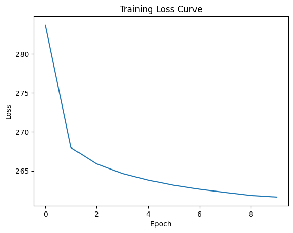
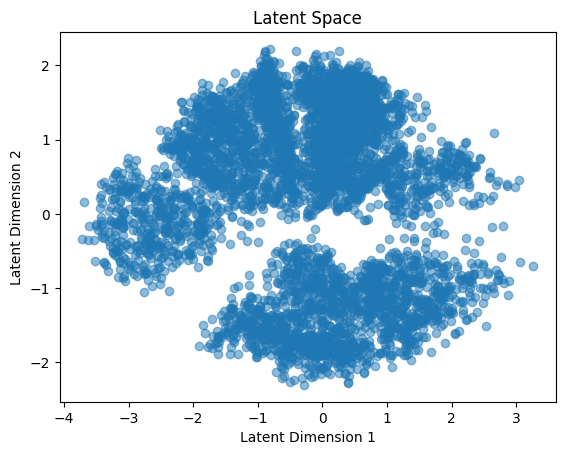
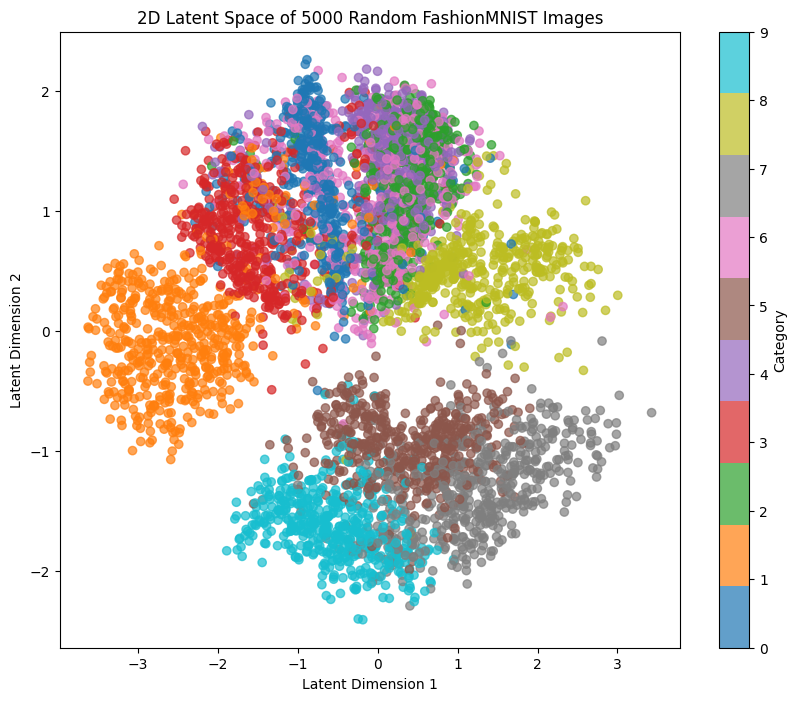
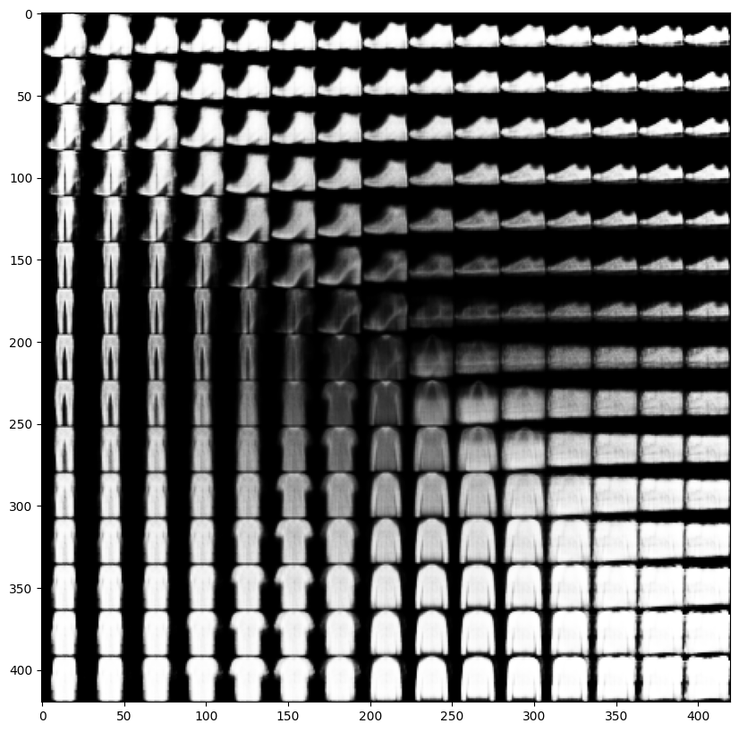
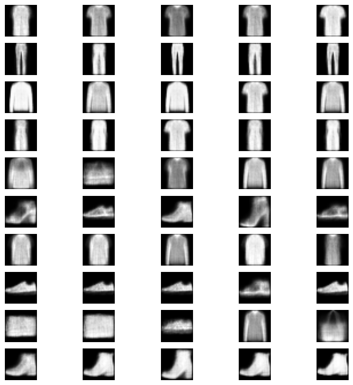

# Variational Autoencoder (VAE) on FashionMNIST

This project demonstrates a Variational Autoencoder (VAE) implemented from scratch using PyTorch to learn a compact, 2D latent representation of the FashionMNIST dataset. It highlights core deep learning principles including encoder-decoder architectures, the reparameterization trick, and latent space sampling — making it an ideal showcase of applied machine learning proficiency.

---

## Objective

- Develop and train a Variational Autoencoder (VAE) using PyTorch.
- Learn and visualize compressed latent representations of image data.
- Generate synthetic FashionMNIST images using decoder sampling.
- Gain insights into model interpretability through visual analysis of the latent space.

---

## Tools & Technologies

| Purpose                  | Tool/Library           |
|--------------------------|------------------------|
| Deep Learning            | PyTorch                |
| Data Handling            | `torchvision.datasets` |
| Visualization            | Matplotlib, NumPy      |
| Dataset                  | FashionMNIST           |
| IDE                      | Google Colab / Jupyter |

---

## Core Components

- **Encoder**: Maps flattened image (784D) to a 2D latent space (mean & log variance).
- **Reparameterization Trick**: Enables backpropagation through stochastic sampling.
- **Decoder**: Reconstructs original image from latent vector.
- **Loss Function**: Combines reconstruction loss (binary cross-entropy) and KL divergence to regularize latent space.

---

## Results

### Training Loss Curve

The model demonstrates steady convergence over 10 epochs.

> _Loss Curve:_
<p align="center">
  
</p>

---

### Latent Space Visualization

#### • Unlabeled Latent Space
> Shows 2D clustering of 5000 samples in latent space.
<p align="center">
  
</p>

#### • Colored by Class
> Each cluster corresponds to a different FashionMNIST category.
<p align="center">
  
</p>

---

### Image Generation

#### • Grid Sampling from Latent Space

Samples from a 15x15 grid across 2D latent dimensions:

<p align="center">
  
</p>

#### • Class-Averaged Latent Sampling

Each row shows slight variations around the latent mean vector for one category:

<p align="center">
  
</p>

---

## Key Learnings

- **Dimensionality Reduction**: Compressing high-dimensional image space into 2D latent representations reveals structure in the data.
- **Generative Modeling**: Once trained, the decoder can generate new, realistic-looking images conditioned on sampled latent vectors.
- **Model Interpretation**: Latent space plots provide intuitive insights into how the model separates categories.

---

## Challenges Faced

- Balancing the trade-off between reconstruction loss and KL divergence.
- Maintaining meaningful variance in a low-dimensional latent space (2D).
- Avoiding mode collapse during training with small latent vectors.

---

## How to Run

1. **Install Dependencies**
```bash
pip install torch torchvision matplotlib numpy
